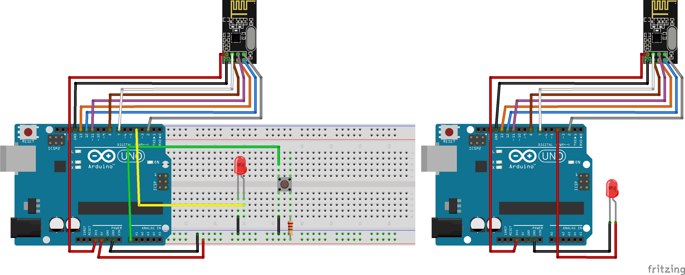

# Reliable Data Transfer (RDT) 3.0

This example is based on RDT 3.0, a reliable delivery protocol.

This protocol is also known as a stop-and-wait protocol: after sending each packet the sender stops and waits for feedback from the receiver indicating that the packet has been received.

Each packet is identified using a single bit (RDT is known as an alternating bit protocol).

## The application
The application uses two nodes, a sender and a receiver. The sender waits for a button click to send a message to the receiver toggles a led.

## Packet
This example sends a 8 bit packet, where
- the left-most bit indicates that the packet is and ACK or a normal message;
- the 7th bit inidicates the packet ID;
- the 6 right-most bits can store data (this example don't use it).

## The sender
- Waits for a button click to send a packet with ID equals 0 (initially). Since it is a message packet, the left-most bit is 0 (00xx.xxxx);
- Waits until an ACK is received;
- If no valid ACK is received in a timeout, the packet is resent
    - A valid ACK is a packet with left-most bit equals 1 and 7th bit equals to the expected ID, in this case 0 (10xx.xxxx);
    - If sender receives two ACKs with same ID (duplicate ACKs), the receiver didn't receive the last sended packet correctly. The sender, then, simply ignores this ACK and retransmit the packet with the timeout;
- If a valid ACK is received, the application
    - Update the next packet ID to 1;
    - Waits for a button click to send a packet;
    - If this new packet (with ID=1) is sent successfully, the next ID is updated to 0 (alternating bit protocol).

## The receiver
- Starts waiting for a message packet (with left-most bit equals 0) with ID equals 0 (00xx.xxxx);
- If the expected packet is received, an ACK packet is created with left-most bit equals 1 (to indicated that it's an ACK, and not a message), and ID equals to the last valid packet received, in this case 0;
- The application, then, alternates the expected ID to receive. In other words, it starts waiting for a message packet with ID equals 1;
- If a message packet arrive with a different ID from expected, the receiver sends an ACK with ID equals to the last valid packet received. For example, if the receiver expects a message with ID=0 and receive a message with ID=1, it ACKs with ID 0.

## Timeout
The RDT 3.0 protocol resends a packet after waiting at least one round-trip delay. For simplicity, this examples uses a fixed timeout of 300ms. Change this value if necessary.

## Examples

## Links
- https://www.d.umn.edu/~gshute/net/reliable-data-transfer.xhtml
- http://www2.ic.uff.br/~michael/kr1999/3-transport/3_040-principles_rdt.htm

