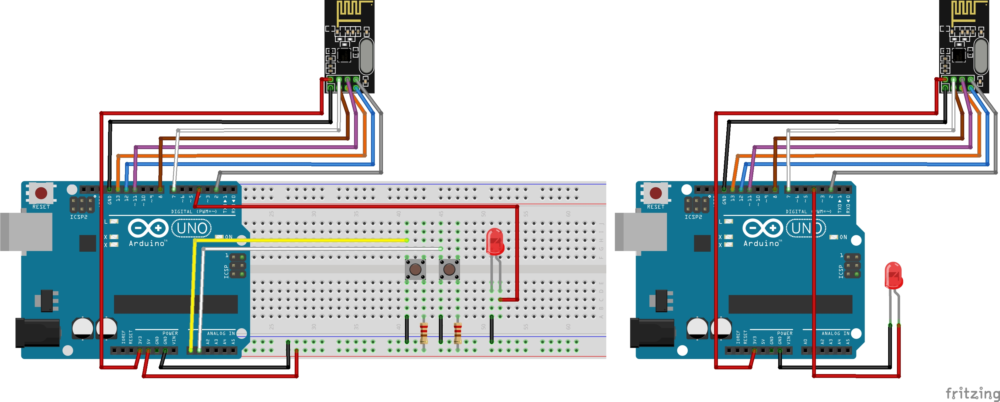

# Toggle Led

This application comunicates 3 nodes, with 1 Tx and 2 Rx, using multiple jumps and TTL.

When a button is pressed, the Tx node sends a message adressed to an especific Rx node.

| Port    | Uno | Rx address |
|---------|-----|------------|
| PCINT8  | A0  | 2          |
| PCINT9  | A1  | 3          |

All nodes in Tx area receives that message and verifies if it is addressed to itself or if it should be retransmitted. In second case, the receivers also verifies the message TTL: if it greater than 0, the TTL is decremented and the message is retransmitted. Otherwise, it is discarded. We use TTL to avoid infinite retransmission loops.

## Circuit


## Message format
The message has 1 byte size, organized as follows:
```seqNumber*100+ttl*10+destAddress```

- seqNumber alternates between 1 and 2
- ttl can vary between 1 and 5. The default is 3
- destAddress can receive a number between 1 and 5. But, since in this example we are working with two receives, one with address 2 and other, 3, destAddress can receive 2 or 3

## Known Issue
### inconsistent state
- First, consider that Tx can communicate directly with Rx2 and Rx3
- Consider, then, that Tx transmit a message with seqNumber=1 and destAddress=3 at t0
- This message is received by Rx2 and Rx3 at time t1
- At t2:
    - Rx3 updates its SpectedSeq to 2 (the initial value is 1)
    - Rx2 retransmit the message
- At t3, Tx transmit other message, also for Rx3, but now with seqNumber=1
- This message arrives at Rx3 at t4
- The receiver updates its seqNumber to 1 at t5
- Only at t6 the retransmitted message arrives
- At t7 the Rx3 updates its seqNumber to 2, an inconsistent state

This generates an inconsistent state and makes impossible for Tx to talk to Rx3

### ACK
This example do not consider package loss, so it should be using nRF24l01+ auto ACK